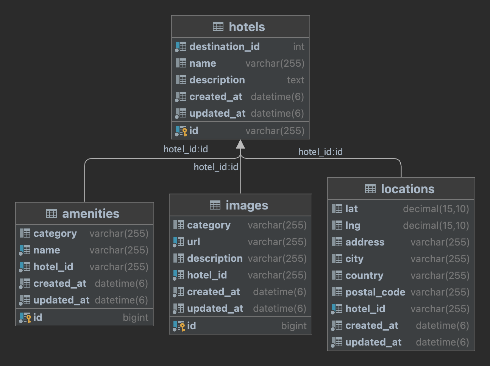
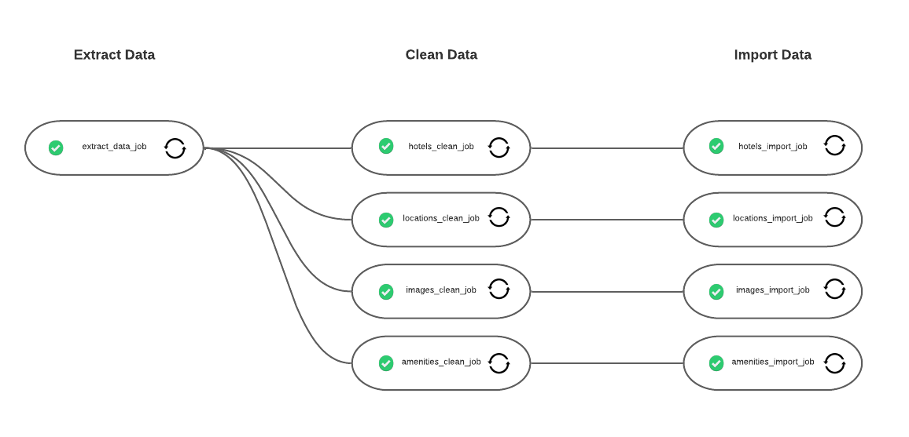

# README

This README would normally document whatever steps are necessary to get the
application up and running.

Things you may want to cover:

* Ruby version
  - 3.1.2
* System dependencies
  - MySQL
  - Redis
* Configuration

* Database creation

  - ```rake db:create```

* Database initialization
  - ```rake db:migrate```
  - ```rake db:seed```

* How to run the test suite

* Services (job queues, cache servers, search engines, etc.)

* Deployment instructions
   - Deploy in local: ```./deploy.sh --dev```
   - Deploy to AWS: ```./deploy.sh --prod```


## Design Overview

**Schema Diagram**



**Data Pipeline**



1. Extract Data

Sidekiq jobs are scheduled to run daily for fetching data from suppliers. The jobs retrieve data by calling the suppliers API endpoint. The jobs parse the JSON object to extract data, which is then restructured to fit a defined schema.
If data is empty for a specific column, I leave that column as null. At this step, the data is organized into four models: hotels, locations, images, and amenities.

For example:

Data is extracted from Supplier 1:
```
[
    {
        "Id": "iJhz",
        "DestinationId": 5432,
        "Name": "Beach Villas Singapore",
        "Latitude": 1.264751,
        "Longitude": 103.824006,
        "Address": " 8 Sentosa Gateway, Beach Villas ",
        "City": "Singapore",
        "Country": "SG",
        "PostalCode": "098269",
        "Description": "  This 5 star hotel is located on the coastline of Singapore.",
        "Facilities": [
            "Pool",
            "BusinessCenter",
            "WiFi ",
            "DryCleaning",
            " Breakfast"
        ]
    }
]
```
After mapping to defined schema:

```
# hotels
[
    {
        "id": "iJhz",
        "destination_id": 5432,
        "name": Beach Villas Singapore,
        "description": "  This 5 star hotel is located on the coastline of Singapore."
    }
]
# locations
[
    {
        "lat": 1.264751,
        "lng": 103.824006,
        "address": " 8 Sentosa Gateway, Beach Villas ",
        "city": "Singapore",
        "country": "SG",
        "postal_code": "098269",
        "hotel_id": "iJhz"
    }
]
# images
[]
# amenities
[
    {
        "name": "Pool",
        "category": null,
        "hotel_id": "iJhz"
    },
    {
        "name": "BusinessCenter",
        "category": null,
        "hotel_id": "iJhz"
    },
    {
        "name": "WiFi",
        "category": null,
        "hotel_id": "iJhz"
    },
    {
        "name": "DryCleaning",
        "category": null,
        "hotel_id": "iJhz"
    },
    {
        "name": " Breakfast",
        "category": null,
        "hotel_id": "iJhz"
    }
]
```


2. Clean Data

Below are general rules applied to string and number type

* String:
   - Remove leading and trailing white space.
   - Compress multiple whitespace to a single space.

* Number:
   - Convert string to number.

Below are rules applied to specific columns

* Hotels#name:
   - Capitalize the first character.

* Hotels#description:
   - Remove all not printable characters.

* Locations#lat & lng:
   - Convert string to decimal.
   - The latitude must be a number between -90 and 90 and the longitude between -180 and 180.

* Locations#address:
   - Capitalize the first character.

* Locations#country:
   - The app have a list of country and country code.
If value in extracted data match with the value in the list, it would be replaced by the value in the list.
For example, `US` would be replaced by the `United States`.

* Locations#city:
   - Similar to country, the app have a list of valid city in a country.

* Locations#postal_code:
   - Similar to country and city, the app have a list of valid postal code in a country.

* Images#category:
   - Convert string to lowercase.

* Images#url:
   - Remove leading and trailing white space.

* Images#description:
   - Capitalize the first character.

* Amenities#category:
   - Convert string to lowercase.

* Amenities#name:
   - Convert string to lowercase.
   - We can pre-defined list of amenities.


3. Import Data

Each models will be imported independently in sidekiq jobs.
Before importing, the job removes null value from the data then insert or update data.
It means that old value will be overridden by new value after updating to ensure data is up-to-date.

**API Contract**

* Route: GET `/api/v1/hotels`

* Query params:
     - destination [Optional]: Destination ID.
     - hotels [Optional]: List of hotel ID, separated by comma `,`.
* Response body:
```
[
    {
        "id": <string>,
        "destination_id": <string>,
        "name": <string>,
        "description": <string>,
        "location": {
            "lat": <string>,
            "lng": <string>,
            "address": <string>,
            "city": <string>,
            "country": <string>,
            "postal_code": <string>,
        },
        "images": {
            <image_category>: [
                {
                    "url": <url_string>,
                    "description": <string>
                }
            ]
        },
        "amenities": {
            <amenity_category>: [
                <amenity_1>,
                <amenity_2>
            ],
        }
    }
]
```
* Response status:
     - 200 Successful


**Improvements**

* Implement bulk import data.
* Implement pagination in API get hotels.